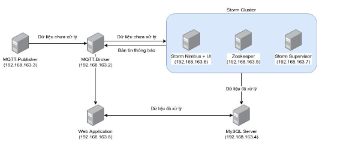

# stormsmarthome
Storm topology to subscribe MQTT broker and analyze smarthome data


## How to create storm topology jar file for development/test or del

**Create enviroment variable for topo**

```cmd
cp sample_env.yaml src/main/resources/config/cred.yaml
```

**Build with maven**
```cmd
mvn install
```
**Run and test (Run with windows size 5,10,15,20,30,60,120 mins)**

```cmd
java -jar target/Storm-IOTdata-1.0-SNAPSHOT-jar-with-dependencies.jar
```
  
Then choose data file.

Note: Output files will be at the same folder with input file.


## How to create storm cluster by docker compose

This is the system topology for this project, which includes:
- MQTT 
    - [MQTT Broker](./mqtt/mqtt-broker/README.md)
    - [MQTT Publisher](./mqtt/mqtt-publisher/README.md)
- Storm cluster
    - Storm nimbus + Storm UI
    - Storm supervisor
    - Zookeeper
- MySQL
- [Web Application](./webapp/iot-data-api/README.md)



### Run topology storm

This [docker compose](./docker-compose.yml) file below will guide you on how to run all the components listed above.

### Create database credential for web app
```sh
cp ./webapp/cred.json.example ./webapp/cred.json
# Edit ./webapp/cred.json base on your environment
```

**Run all storm cluster**

```cmd
docker compose up -d
```

**Then apply iot-data-smarthome topo**

```cmd
docker cp target/Storm-IOTdata-1.0-SNAPSHOT-jar-with-dependencies.jar nimbus:/

docker exec -it nimbus bash

storm jar Storm-IOTdata-1.0-SNAPSHOT-jar-with-dependencies.jar com.storm.iotdata.MainTopo
```

**Run MQTT components**

After create storm cluster topology which have MQTT broker container, we need run MQTT publisher to send data to MQTT broker and storm will receive data. To run MQTT publisher follow [this guide](./mqtt/mqtt-publisher/README.md).